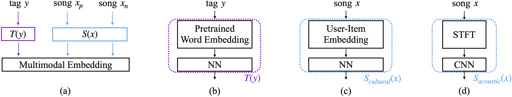
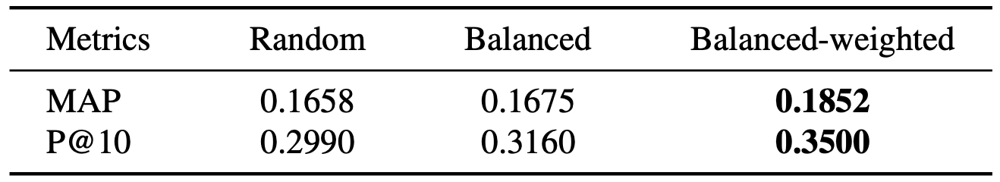
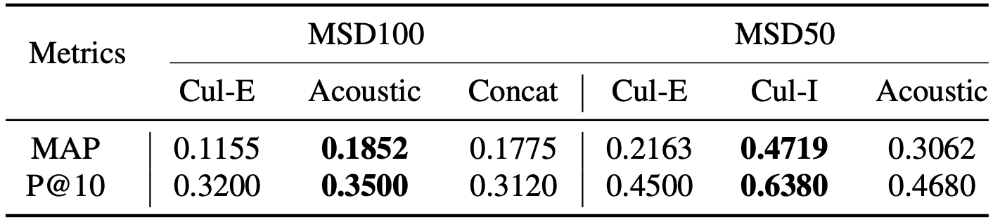
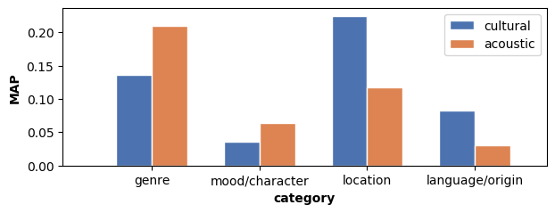
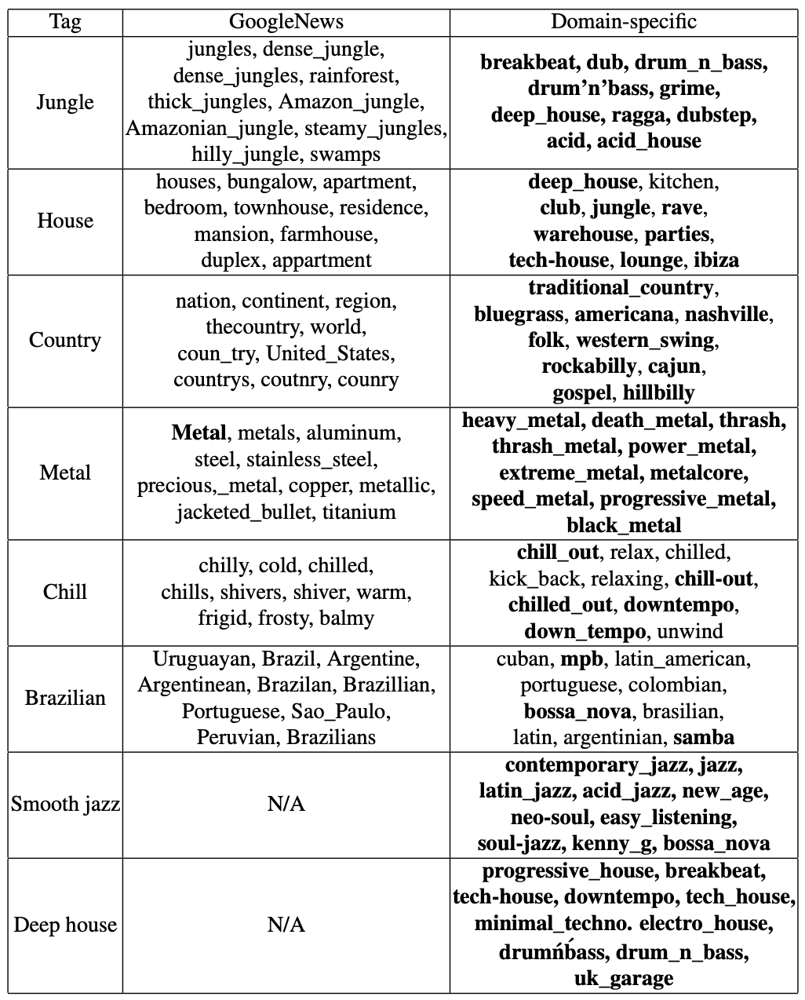

# Multimodal Metric Learning for Tag-based Music Retrieval
[](https://opensource.org/licenses/MIT)

⚡️ PyTorch Lightning implementation of multimodal metric learning model for tag-based music retrieval.

Also, we release [*MSD500*](#dataset) which is a manually cleaned version of the Million Song Dataset (MSD) with 500 tags and EchoNest User Taste Profiles.

## Reference

**Multimodal Metric Learning for Tag-based Music Retrieval**, Submitted to ICASSP 2021 [[arxiv](https://arxiv.org/abs/)]

-- Minz Won, Sergio Oramas, Oriol Nieto, Fabien Gouyon, Xavier Serra


**TL;DR**

- Sampling matters. Try to use elaborate triplet sampling instead of random sampling.
- Each modality has own strength for tag prediction based on the original source of information. 
- But the foremost important factors are the size and quality of data.
- Domain-specific word embedding facilitates more musical context in tag-based music retrieval.


## Requirements
```
conda create -n YOUR_ENV_NAME python=3.7
conda activate YOUR_ENV_NAME
pip install -r requirements.txt
```


## Preprocessing
### Data split
Our data split is already included in the [dataset](#dataset) that we provide. Check `reproducible_splits.tar.gz` from the link. The following preprocessing steps are for the researchers who want to customize their data splits.

```
python -u step1_data_split.py run YOUR_DATA_PATH    TOP_N_TAGS    MINIMUM_NUMBER_OF_TAGS_IN_EACH_SPLIT
python -u step2_word_embedding.py run YOUR_DATA_PATH
python -u step3_taste_profile.py run YOUR_DATA_PATH
```
### Audio preprocessing (Mel spectrogram)
```
sampling rate: 22050Hz
FFT window: Hanning
window length: 1024
hop size: 512
number of Mel bands: 128
```


## Training
You can find an example from `run.sh`.

```
python -u main.py --mode 'TRAIN' --PARAMETER YOUR_PARAMETER
```

Options

```
'--num_workers', type=int, default=0
'--mode', type=str, default='TRAIN', choices=['TRAIN', 'TEST']

# model parameters
'--batch_size', type=int, default=128
'--num_chunk', type=int, default=8
'--input_length', type=int, default=173
'--margin', type=float, default=0.4
'--input_type', type=str, default='spec', choices=['spec, 'cf', 'hybrid']
'--w2v_type', type=str, default='google', choices=['google', 'music']
'--is_balanced', type=bool, default=False
'--is_weighted', type=bool, default=False

# training parameters
'--n_epochs', type=int, default=200
'--gpu_id', type=str, default='0'
'--lr', type=float, default=1e-4
'--model_save_path', type=str, default='./checkpoints'
'--model_load_path', type=str, default='.'
'--data_path', type=str, default='.'
'--neptune_project', type=str, default='.'
'--neptune_api_key', type=str, default='.'
```

## Evaluation
You can find an example from `eval.sh`.

```
python -u main.py --mode 'TEST' --PARAMETER YOUR_PARAMETER
```

## Dataset
### 1. Cleanup process
- Filter out all tracks not included in the MSD Taste Profile.
- Filter out all tag annotations with a Last.fm tag score of 50 (Last.fm tags in the original dataset come with a score between 0 and 100).
- Filter out all tracks with more than 20 tags (we assume that annotations in tracks with too many tags are less reliable).
- Preprocessing of tags: remove punctuation, normalize expressions (e.g., and, \&, 'n'), and remove irrelevant suffixes (e.g., music, song, tag).
- Group all tags with the same preprocessed lemma and name the group with the most common of the involved tags (e.g., [rock music, rock, rock songs, rock tag] -> 'rock').
- Select all tag groups with annotations for at least 100 tracks.


### 2. How to download
You can simply download from this [Google Drive link](https://drive.google.com/drive/folders/1Y_XY4vdiVvqvEoe3HQcDx3wawBEgsl0o?usp=sharing).

- `msd500.tar.gz`: Manually cleaned subset of the MSD. Columns of `track_tags.tsv` are [song\_id, original\_tag, cleaned\_tag, tag\_category, score].
- `music_w2v.tar.gz`: Domain-specific word embeddings pretrained with music-related text.
- `reproducible_splits.tar.gz`: Data splits used in our experiments (MSD100 and MSD50). You can skip preprocessing steps with this. Also you can skip other files.
- `user_item_embs.tar.gz`: Collaborative filtering embeddings of EchoNest User Taste Profile.


Due to security/privacy issues, our in-house user-item embeddings are not included.

## Model overview


(a) Our triplet network. For a given anchor tag *y*, the model maps a positive song *x_p* to be closer than a negative song *x_n* from the anchor in the multimodal embedding space.

(b) Tag embedding branch *T(y)*. 

(c) Cultural song embedding branch *S_cultural(x)*. We used collaborative filtering.

(d) Acoustic song embedding branch *S_acoustic(x)*. We used short-chunk CNN ([reference](https://arxiv.org/abs/2006.00751)).


## Experimental results
### 1. Sampling matters
We tried three different triplet sampling methods. Our baseline is random sampling. But with random sampling, minor tags have less chance to be sampled during the training. To alleviate this, we uniformly select tags first, then sample positive and negative items (balanced sampling). Further, we added the weighted sampling method ([reference](https://arxiv.org/abs/1706.07567)) to sample hard, semi-hard, and soft negative examples efficiently. As shown in the table below, balanced-weighted sampling showed the best result.



### 2. Cultural vs Acoustic information
We believe certain groups of tags are more related to acoustic information while others may be more culturally relevant. A tag *piano*, for example, can be predicted using the user-item matrix if there is a specific group of users who heavily listened to songs with piano. However, originally, the tag *piano* is associated with acoustic information. When there is a song beloved by the aforementioned user group, if we only use cultural information, the song can be regarded as piano music even when no piano can be acoustically perceived in the song. 

As another example, a tag *K-pop* can be predicted based on acoustic information since there are common acoustic characteristics of *K-pop*. However, if the song is not from Korea and is not being consumed in Korea, it should not be tagged as *K-pop*. 
To investigate the capability of two different information sources, we train our metric learning model with cultural information only (Cul-E, Cul-I) and acoustic information only (Acoustic). **-E** stands for EchoNestUserTasteProfile and **-I** stands for in-house data.





In general, the acoustic model outperforms the cultural model (Acoustic > Cul-E). However, if we take a closer look at category-wise performance, acoustic model shows its strength in *genre* and *mood/character* while cultural model shows the strength in *location* and *language/origin* tags. This supports our hypothesis that the source of information matters for the tag prediction.

But the foremost important factors are the size and quality of available data. As shown in the table above, with our in-house user-item information (Cul-I), the cultural model outperforms the acoustic model. It outperformed in every category including *genre*, *mood/character*, and even *instruments*. Since our in-house data have 100B explicit user feedbacks, the cultural model becomes more powerful than using relatively small and implicitly created data (Cul-E).

A simple concatenation of cultural and acoustic information (Concat) did not improve. We leave this hybrid method as a future challenge.

### 3. Domain-specific word embeddings
We compare two different word embeddings by checking nearest neighbors of the given tag. One is pretrained with Google News while our proposed domain-specific one is pretrained with more musical text, such as Amazon reviews, music biographies, and Wikipedia pages about theory and music genres. This domain-specific word embeddings are included in our [dataset](#dataset).



- Some music genres (jungle, house, country, metal) have different meaning from our daily vocabulary. The proposed domain-specific word embeddings successfully catch the musical context. Music-related words are emboldened.
- *Chill* means relaxing mood in musical context. Domain-specific word embeddings could capture similar moods while general word embeddings could not.
- Also, for a given tag *Brazilian*, domain-specific one successfully returns *mpb (música popular brasileira)*, *bossa nova*, and *samba*.
- Some musical bi-grams do not existing in the general word embeddings since they are less frequent in news. But the domain-specific word embeddings include such bi-grams and tri-grams (e.g., *smooth jazz* and *deep house*).


## Citation
```
@article{won2020multimodal,
  title={Multimodal Metric Learning for Tag-based Music Retrieval},
  author={Won, Minz and Oramas, Sergio and Nieto, Oriol and Gouyon, Fabien and Serra, Xavier},
  journal={arXiv preprint arXiv:2011.00000},
  year={2020}
}
```

## License
```
MIT License

Copyright (c) 2020 Music Technology Group, Universitat Pompeu Fabra. Code developed by Minz Won.

Permission is hereby granted, free of charge, to any person obtaining a copy
of this software and associated documentation files (the "Software"), to deal
in the Software without restriction, including without limitation the rights
to use, copy, modify, merge, publish, distribute, sublicense, and/or sell
copies of the Software, and to permit persons to whom the Software is
furnished to do so, subject to the following conditions:

The above copyright notice and this permission notice shall be included in all
copies or substantial portions of the Software.

THE SOFTWARE IS PROVIDED "AS IS", WITHOUT WARRANTY OF ANY KIND, EXPRESS OR
IMPLIED, INCLUDING BUT NOT LIMITED TO THE WARRANTIES OF MERCHANTABILITY,
FITNESS FOR A PARTICULAR PURPOSE AND NONINFRINGEMENT. IN NO EVENT SHALL THE
AUTHORS OR COPYRIGHT HOLDERS BE LIABLE FOR ANY CLAIM, DAMAGES OR OTHER
LIABILITY, WHETHER IN AN ACTION OF CONTRACT, TORT OR OTHERWISE, ARISING FROM,
OUT OF OR IN CONNECTION WITH THE SOFTWARE OR THE USE OR OTHER DEALINGS IN THE
SOFTWARE.
```

## Pretrained models
Available upon request. 

minz.won@upf.edu

🚫 I can only share pretrained models using public data. I do not share the model trained with our in-house data.

